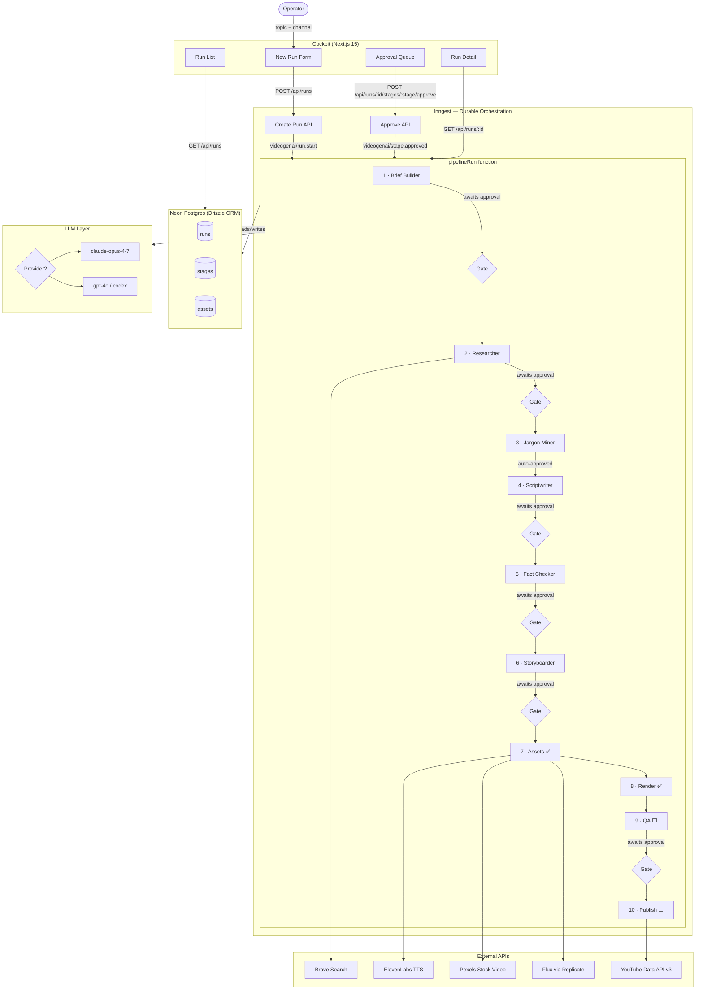

# VideoGenAI

An end-to-end pipeline that turns a one-line topic into a researched, scripted, animated, voiced YouTube video — with a human-approval cockpit between every stage.

Multi-channel by design. Channel behavior (tone, source-balancing rules, jargon depth, visual style) is config-driven, not hardcoded. Adding a new channel is a config file, not a code change.

## Status

**Stages 1–8 complete and wired.** Full text pipeline (brief → research → jargon → script → fact-check → storyboard) plus asset generation (TTS + stock video + AI stills) and render manifest assembly are production-ready. QA and publish (stages 9–10) are next.

| Phase                                                | Status |
| ---------------------------------------------------- | ------ |
| DB schema + migrations                               | Done   |
| LLM adapter (Anthropic + OpenAI kill switch)         | Done   |
| Brief builder                                        | Done   |
| Researcher (Brave Search + page fetch)               | Done   |
| Jargon miner                                         | Done   |
| Scriptwriter                                         | Done   |
| Fact checker                                         | Done   |
| Storyboarder                                         | Done   |
| Inngest orchestration + approval gates               | Done   |
| Cockpit UI (run list, detail, approvals)             | Done   |
| Cockpit revision flow (edit JSON, re-run w/feedback) | Done   |
| Pipeline pause / resume kill switch                  | Done   |
| Asset generation (ElevenLabs + Pexels + Flux)        | Done   |
| Assembler (render manifest + asset copy)             | Done   |
| Cockpit asset preview (audio, image/video grid)      | Done   |
| Retry assets button (re-run stages 7–8 only)         | Done   |
| QA stage                                             | Next   |
| YouTube publish                                      | Next   |

## Pipeline



### Stage details

| #   | Stage         | LLM | Approval | Output                                               |
| --- | ------------- | --- | -------- | ---------------------------------------------------- |
| 1   | Brief Builder | Yes | Human    | Angle, audience note, must-cover/avoid, tone         |
| 2   | Researcher    | Yes | Human    | FactPack: sources + verified facts                   |
| 3   | Jargon Miner  | Yes | Auto     | Term → definition pairs                              |
| 4   | Scriptwriter  | Yes | Human    | Scenes with text + citations + duration              |
| 5   | Fact Checker  | Yes | Human    | Score, verdict, issues list                          |
| 6   | Storyboarder  | Yes | Human    | Scenes with visual briefs + shot types               |
| 7   | Assets        | —   | —        | narration.mp3 + b-roll clips + AI stills manifest    |
| 8   | Render        | —   | —        | render-manifest.json + asset directory (MP4 via CLI) |
| 9   | QA            | Yes | Human    | Quality report + issues                              |
| 10  | Publish       | —   | —        | YouTube upload + metadata                            |

## Cockpit features

- **Run list** — all runs with status chips; click to open detail
- **Stage cards** — collapsible, show output, metrics, timestamps
- **Approval gates** — approve as-is, edit JSON inline, or re-run stage with feedback
- **Asset preview** — narration audio player, 16:9 image/video grid with hover-play
- **Render manifest viewer** — resolution, duration, asset paths
- **Retry assets** — re-run stages 7–8 without touching LLM stages (saves API cost when asset keys are newly added)
- **Pause / resume** — pause the pipeline at any inter-stage boundary; resume picks up from the exact same point (Inngest `waitForEvent`, zero compute while paused)
- **Pipeline visualiser** — glossy stage nodes with per-state color glow (done=green, running=cyan, approval=amber, failed=red)
- **LLM provider toggle** — switch between OpenAI and Anthropic in the header without restarting

## Stack

- **Orchestration:** Inngest (durable steps, human-approval gates, pause/resume, 14-day timeouts)
- **LLM:** Anthropic Claude / OpenAI GPT — switchable via cockpit toggle or `LLM_PROVIDER` env
- **Video:** Remotion (React-based video composition — run locally via CLI)
- **Cockpit:** Next.js 15 App Router
- **DB:** Neon Postgres + Drizzle ORM
- **Voice:** ElevenLabs (free-tier Adam voice; bring your own voice ID on paid plan)
- **Visuals:** Pexels stock video + Flux Schnell via Replicate
- **Search:** Brave Search API
- **Publish:** YouTube Data API v3

## Quickstart

> Requires Node 20+ and [pnpm](https://pnpm.io/) 9+.

```bash
pnpm install
cp .env.example .env
pnpm --filter @videogenai/db db:migrate   # apply schema to Neon
pnpm dev                                  # cockpit on :3000, Inngest dev on :8288
```

Then open [localhost:3000/runs/new](http://localhost:3000/runs/new), pick a channel, enter a topic, and watch the pipeline run.

### Required API keys

| Key                                     | Used by                          | Get it at                                   |
| --------------------------------------- | -------------------------------- | ------------------------------------------- |
| `DATABASE_URL`                          | DB (all stages)                  | [neon.tech](https://neon.tech)              |
| `OPENAI_API_KEY` or `ANTHROPIC_API_KEY` | LLM stages 1–6                   | platform.openai.com / console.anthropic.com |
| `BRAVE_SEARCH_API_KEY`                  | Stage 2 researcher               | api.search.brave.com                        |
| `ELEVENLABS_API_KEY`                    | Stage 7 TTS                      | elevenlabs.io                               |
| `PEXELS_API_KEY`                        | Stage 7 stock video              | pexels.com/api                              |
| `REPLICATE_API_TOKEN`                   | Stage 7 AI stills (Flux Schnell) | replicate.com                               |

`ELEVENLABS_DEFAULT_VOICE_ID` is optional — defaults to Adam (`pNInz6obpgDQGcFmaJgB`), which works on the free tier. Library voices require a paid ElevenLabs plan.

To render the assembled video as MP4, run Remotion locally after stage 8 completes:

```bash
npx remotion render apps/web/public/assets/runs/<run-id>/render-manifest.json
```

## Claude Code skills

Custom slash commands for working on this repo — run them in Claude Code:

| Command        | What it does                                                                       |
| -------------- | ---------------------------------------------------------------------------------- |
| `/add-stage`   | Scaffolds a new pipeline agent stage (Zod schema, LLM call, db-ops, approval gate) |
| `/add-channel` | Creates a new channel config following the existing schema                         |
| `/db-migrate`  | Applies pending Drizzle migrations to Neon                                         |
| `/run-status`  | Shows recent pipeline runs and any stages awaiting approval                        |

## Monorepo layout

```
apps/
  web/              # Next.js 15 cockpit (UI + API routes + Inngest handler)
packages/
  db/               # Drizzle schema, migrations, Neon client
  pipeline/         # Agent stages, Inngest orchestration, LLM adapter, skills
  types/            # Shared Zod schemas and TypeScript types
docs/
  PLAN.md           # Phased build plan
  ARCHITECTURE.md   # Stage details and data flow
  CHANNELS.md       # Channel config schema
.claude/
  commands/         # Claude Code custom slash commands
```

## Channels

1. **Aussie politics explained for dummies** — explainer style, jargon-defined, source-balanced, no political skew
2. **Latest tech explainers** — fresh news ingested, technical terms unpacked

More channels added as YAML configs once the pipeline stabilizes.

## Docs

- [PLAN.md](docs/PLAN.md) — phased build plan
- [ARCHITECTURE.md](docs/ARCHITECTURE.md) — stage details, agents, data flow
- [CHANNELS.md](docs/CHANNELS.md) — channel config schema
- [AGENTS.md](AGENTS.md) — guide for AI coding assistants on this repo

## License

Proprietary — all rights reserved.
