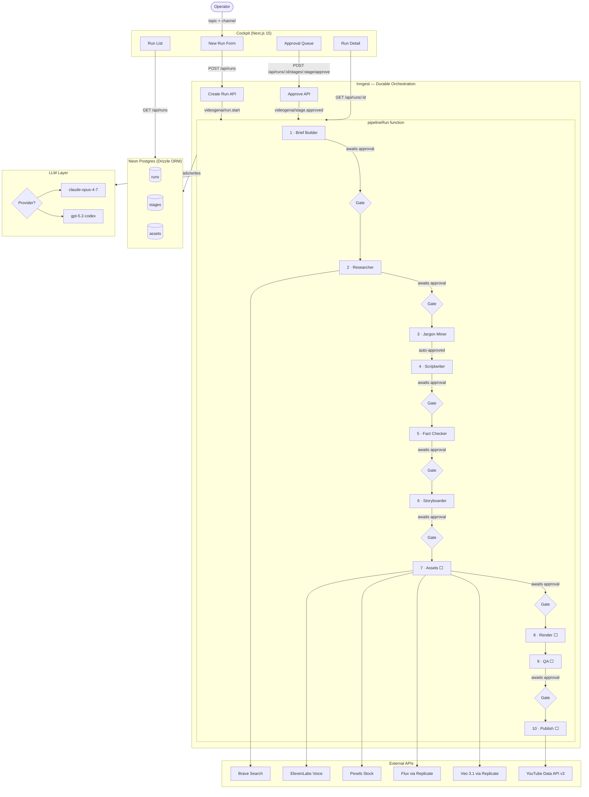

# VideoGenAI

An end-to-end pipeline that turns a one-line topic into a researched, scripted, animated, voiced YouTube video — with a human-approval cockpit between every stage.

Multi-channel by design. Channel behavior (tone, source-balancing rules, jargon depth, visual style) is config-driven, not hardcoded. Adding a new channel is a config file, not a code change.

## Status

**Stages 1–6 complete and wired.** Text pipeline (brief → research → jargon → script → fact-check → storyboard) is production-ready with approval gates. Asset generation, render, QA, and publish (stages 7–10) are next.

| Phase                                               | Status |
| --------------------------------------------------- | ------ |
| DB schema + migrations                              | Done   |
| LLM adapter (Anthropic + OpenAI kill switch)        | Done   |
| Brief builder                                       | Done   |
| Researcher (Brave Search + page fetch)              | Done   |
| Jargon miner                                        | Done   |
| Scriptwriter                                        | Done   |
| Fact checker                                        | Done   |
| Storyboarder                                        | Done   |
| Inngest orchestration + approval gates              | Done   |
| Cockpit UI (run list, detail, approvals)            | Done   |
| Asset generation (ElevenLabs + Pexels + Flux + Veo) | Next   |
| Remotion render                                     | Next   |
| QA stage                                            | Next   |
| YouTube publish                                     | Next   |

## Pipeline



### Stage details

| #   | Stage         | LLM | Approval | Output                                       |
| --- | ------------- | --- | -------- | -------------------------------------------- |
| 1   | Brief Builder | Yes | Human    | Angle, audience note, must-cover/avoid, tone |
| 2   | Researcher    | Yes | Human    | FactPack: sources + verified facts           |
| 3   | Jargon Miner  | Yes | Auto     | Term → definition pairs                      |
| 4   | Scriptwriter  | Yes | Human    | Scenes with text + citations + duration      |
| 5   | Fact Checker  | Yes | Human    | Score, verdict, issues list                  |
| 6   | Storyboarder  | Yes | Human    | Scenes with visual briefs + shot types       |
| 7   | Assets        | —   | Human    | Voice file + b-roll clips + stills           |
| 8   | Render        | —   | —        | Remotion → MP4                               |
| 9   | QA            | Yes | Human    | Quality report + issues                      |
| 10  | Publish       | —   | —        | YouTube upload + metadata                    |

## Stack

- **Orchestration:** Inngest (durable steps, human-approval gates, 7-day timeouts)
- **LLM:** Anthropic Claude / OpenAI GPT — switchable via cockpit toggle or `LLM_PROVIDER` env
- **Video:** Remotion (React-based video composition)
- **Cockpit:** Next.js 15 App Router
- **DB:** Neon Postgres + Drizzle ORM
- **Voice:** ElevenLabs
- **Visuals:** Pexels + Flux (stills) + Veo 3.1 (b-roll) — all via Replicate
- **Search:** Brave Search API
- **Publish:** YouTube Data API v3

## Quickstart

> Requires Node 20+ and [pnpm](https://pnpm.io/) 9+.

```bash
pnpm install
cp .env.example .env       # add DATABASE_URL, OPENAI_API_KEY or ANTHROPIC_API_KEY, BRAVE_SEARCH_API_KEY
pnpm --filter @videogenai/db db:migrate   # apply schema to Neon
pnpm dev                                  # cockpit on :3000, Inngest dev on :8288
```

Then open [localhost:3000/runs/new](http://localhost:3000/runs/new), pick a channel, enter a topic, and watch the pipeline run.

## Claude Code skills

Custom slash commands for working on this repo — run them in Claude Code:

| Command        | What it does                                                                       |
| -------------- | ---------------------------------------------------------------------------------- |
| `/add-stage`   | Scaffolds a new pipeline agent stage (Zod schema, LLM call, db-ops, approval gate) |
| `/add-channel` | Creates a new channel config following the existing schema                         |
| `/db-migrate`  | Applies pending Drizzle migrations to Neon                                         |
| `/run-status`  | Shows recent pipeline runs and any stages awaiting approval                        |

## Monorepo layout

```
apps/
  web/              # Next.js 15 cockpit (UI + API routes + Inngest handler)
packages/
  db/               # Drizzle schema, migrations, Neon client
  pipeline/         # Agent stages, Inngest orchestration, LLM adapter
  types/            # Shared TypeScript types
docs/
  PLAN.md           # Phased build plan
  ARCHITECTURE.md   # Stage details and data flow
  CHANNELS.md       # Channel config schema
.claude/
  commands/         # Claude Code custom slash commands
```

## Channels

1. **Aussie politics explained for dummies** — explainer style, jargon-defined, source-balanced, no political skew
2. **Latest tech explainers** — fresh news ingested, technical terms unpacked

More channels added as YAML configs once the pipeline stabilizes.

## Docs

- [PLAN.md](docs/PLAN.md) — phased build plan
- [ARCHITECTURE.md](docs/ARCHITECTURE.md) — stage details, agents, data flow
- [CHANNELS.md](docs/CHANNELS.md) — channel config schema
- [AGENTS.md](AGENTS.md) — guide for AI coding assistants on this repo

## License

MIT — see [LICENSE](LICENSE).
